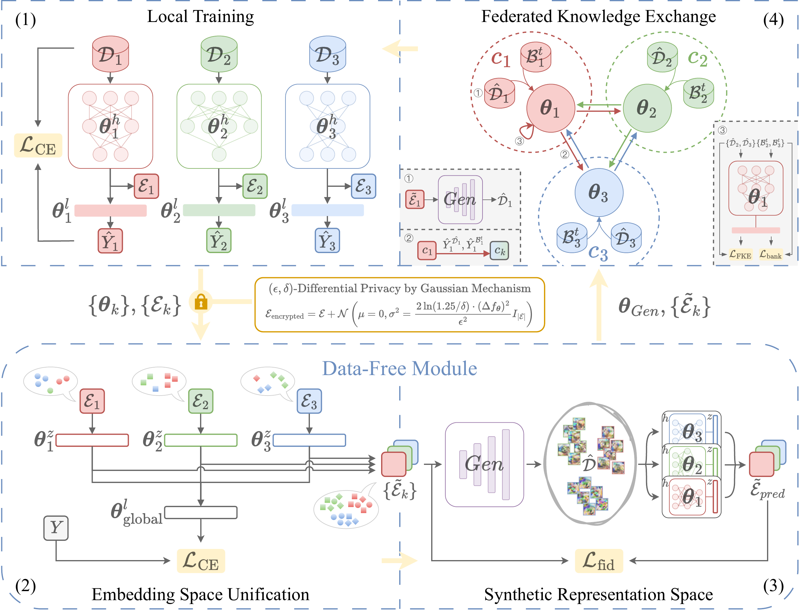

# Aggregation-Free Heterogeneous Federated Learning with Data-Free Knowledge Exchange

This is the official implementation of _Data-Free Federated Knowledge Exchange (DFFKE)_, accepted to TMLR. DFFKE enables direct knowledge sharing between clients and eliminates the need for a global model. With our proposed data-free module, we achieved direct communication amount heterogenous clients without relying on public datasets. The framework aligns client embedding spaces, trains an embedding decoder to synthesize transfer data, and performs federated knowledge exchange with a memory buffer.

<p align="center">
  
</p>

The baseline algorithm implementation is adopted from [HtFLlib](https://github.com/TsingZ0/HtFLlib).

## Environments

Install [CUDA](https://docs.nvidia.com/cuda/cuda-toolkit-release-notes/index.html).

Install [Miniconda](https://repo.anaconda.com/miniconda/Miniconda3-latest-Linux-x86_64.sh), then create and activate the environment:

```bash
conda env create -f env_cuda_latest.yaml
conda activate DFFKE
```

The provided [env_cuda_latest.yaml](env_cuda_latest.yaml) uses Python 3.11 with PyTorch 2.2.0 and CUDA 12.1. Depending on your GPU driver and CUDA installation, you may need to adjust or reinstall PyTorch to match your server. See the [official PyTorch installation selector](https://pytorch.org/get-started/locally/) for the correct command.

The lightweight [requirements.txt](requirements.txt) is kept as a pip dependency reference, but the conda environment file is the recommended setup path.

## Running Experiments

We use `YAML` files to configure experiment hyperparameters. A template is provided in [DFFKE.yaml](configs/DFFKE.yaml), where each parameter is described in detail.

You can run experiment by specifying a standalone configuration file. For example:

```bash
python main.py --config_file DFFKE.yaml
```

Additionally, all experiment configurations can be found in the [configs](configs) folder. Each subfolder represents a batch of experiments, wherein the `__init__.yaml` file contains the macro settings for the entire group, and other files specify the detailed settings for individual experiments.

To reproduce the experimental results, run the provided batch scripts from the project root folder. The scripts are stored in [batch_experiment_script](batch_experiment_script), set `DFFKE_DIR` automatically, and write logs to `logs/`.

```bash
sh batch_experiment_script/experiments_CIFAR10_Dir0.1_HtFE1.sh
sh batch_experiment_script/experiments_CIFAR10_Dir0.1_HtFE1_PFL.sh
sh batch_experiment_script/experiments_CIFAR10_Dir1.0_HtFE1.sh
sh batch_experiment_script/experiments_CIFAR10_Dir1.0_HtFE1_PFL.sh
sh batch_experiment_script/experiments_CIFAR100_Dir0.1_HtFE1.sh
sh batch_experiment_script/experiments_CIFAR100_Dir0.1_HtFE1_PFL.sh
sh batch_experiment_script/experiments_CIFAR100_Dir1.0_HtFE1.sh
sh batch_experiment_script/experiments_CIFAR100_Dir1.0_HtFE1_PFL.sh
sh batch_experiment_script/experiments_CIFAR100_Dir1.0_HtFE1_PFL_20.sh
sh batch_experiment_script/experiments_CIFAR100_Dir1.0_HtFE1_PFL_50.sh
sh batch_experiment_script/experiments_CIFAR100_Dir1.0_HtFE1_PFL_100.sh
sh batch_experiment_script/experiments_CIFAR100_Dir1.0_HtFE2.sh
sh batch_experiment_script/experiments_CIFAR100_Dir1.0_HtFE5.sh
sh batch_experiment_script/experiments_CIFAR100_Dir1.0_HtFE10.sh
sh batch_experiment_script/experiments_TinyImageNet_Dir0.1_HtFE1.sh
sh batch_experiment_script/experiments_TinyImageNet_Dir0.1_HtFE1_PFL.sh
sh batch_experiment_script/experiments_TinyImageNet_Dir1.0_HtFE1.sh
sh batch_experiment_script/experiments_TinyImageNet_Dir1.0_HtFE1_PFL.sh
sh batch_experiment_script/experiments_ablation_CIFAR100_Dir1.0_HtFE1.sh
sh batch_experiment_script/run_experiments.sh
```

**Note:** You may need to modify the `device_id` to specify which GPU device to use. The batch scripts use `ts` for timestamped logs; on Ubuntu, it is provided by `moreutils`.
